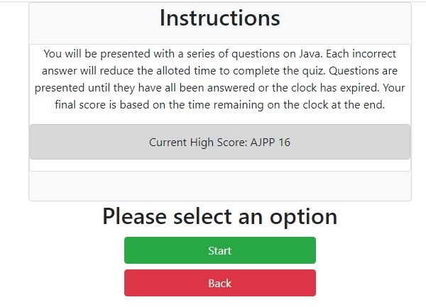
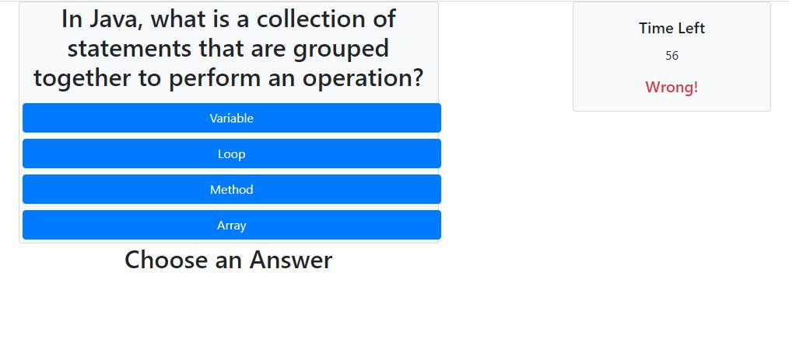
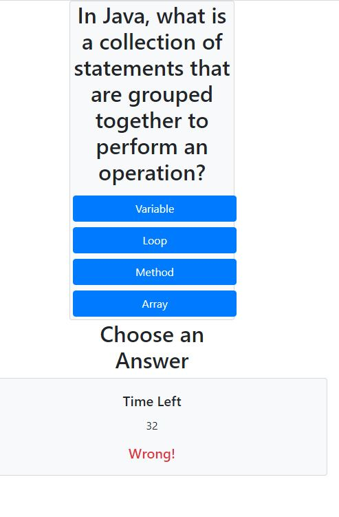

# Code-Quiz

# Project Title
Week 4 Homework Project - Code Quiz

# Motivation 
This homework file will deliver a quiz game that is cutomizable to deliver new content with minor edits to the java code. It can be expanded to accept many categories and an unlimited number of questions per category with dyanmic time applied based on the number of questions and individual scores saved for each category.

# Code Style
This project is written using Java script and the Bootstrap CDN for layout and mobile responsiveness. Bootstrap Java libraries are included but not ulilized.

# Screenshots

Instructions Screen

Full Screen View

Mobile Layout View

# Features
Answers are randomized on each play through to avoid repetition.

DOM is dynamically rebuilt to allow quick refresh without loading a new page.

Categories and questions are compltely customizable with little skill required.

# Code Example
This is an example of the object containing quiz question data. New categories or question sets can be added to expand the quiz.

categories = {
            javaQuestions: {
                category: "Java",
                qSet1: {
                    question: "In Java, what is a collection of statements that are grouped together to perform an operation?",
                    wrongAnswers: ["Loop", "Array", "Variable"],
                    rightAnswer: "Method"
                },
                qSet2: {
                    question: "Which type of variable has only two possible values, true or false?",
                    wrongAnswers: ["String", "Integer", "Function"],
                    rightAnswer: "Boolean"
                }

This section is an example of one that handles switching the display of specific elements on or off

        function toggleClock(clockSwitch) {
            if (clockSwitch === "off") {
                document.getElementById("quiz-clock").setAttribute("class", "card text-center bg-light d-none");
            }
            else if (clockSwitch === "on") {
                document.getElementById("quiz-clock").setAttribute("class", "card text-center bg-light")
            }
        }

# How to Use
Choose a category to view high scores if they exist and begin the quix. Alternatively, back button may be selected on instructions screen to return to category selection. Each wrong answer during the quiz will penalize 3 seconds with an allotment of 6 seconds per question given at the start. Initials can be entered at the end and will display on next run if they are the highest.

